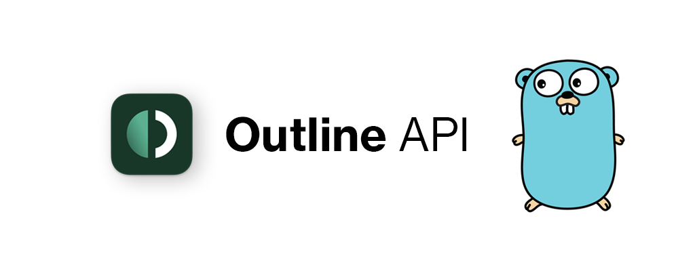

# Outline API



[Outline VPN](https://getoutline.org) handler via http API, written in Go

## How to install

`go get -u github.com/hteppl/go-outline-vpn`

## Examples

```go
// indev
```

## Libraries

[fasthttp](https://github.com/valyala/fasthttp) fast HTTP implementation for Go.

## License

This project is licensed under the [MIT License](https://opensource.org/licenses/MIT)
